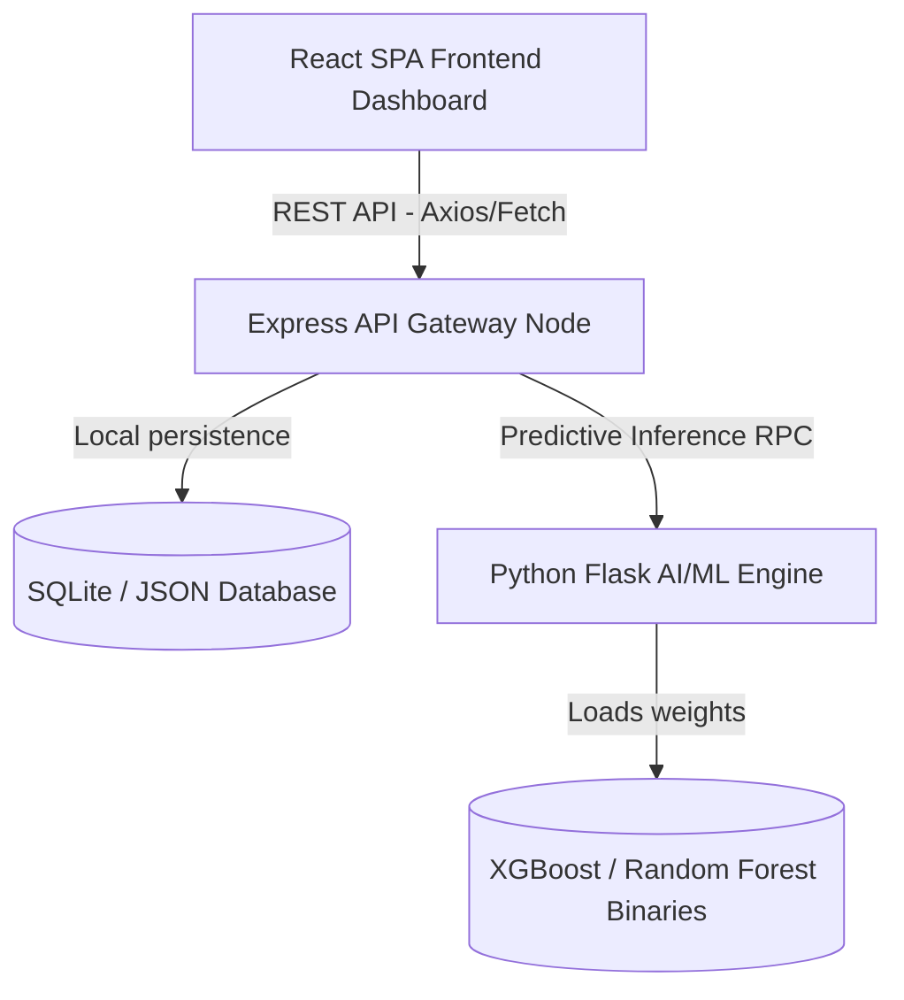

# CRM System Architecture Design Overview

The AI CRM System is engineered as a three-tier decoupled microservice application designed to optimize security, speed, and intelligence modularity.

## Layer Descriptions

### 1. User Interface (Vite + React SPA)
- Built with vanilla CSS for custom glassmorphism styling parameters.
- Recharts is configured to render telemetry area and pie metrics.
- Leverages local storage token sessions to establish route guards.

### 2. Core business Logic (Express API Gateway)
- Secure JWT-token authentication and endpoint authorization middleware.
- Request interceptors to write operations audit trail straight to database.
- Smart fallbacks: If the Python Engine is offline, the backend self-corrects using hardcoded statistical ML rules to score leads and evaluate retention risks.

### 3. Machine Learning (Python Flask Engine)
- Standalone inference REST service.
- Houses training pipelines (`training.py`) and pre-trained XGBoost classifiers.
